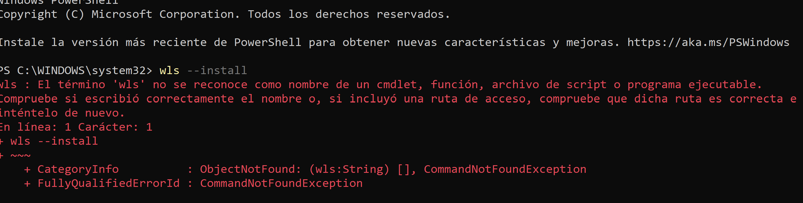
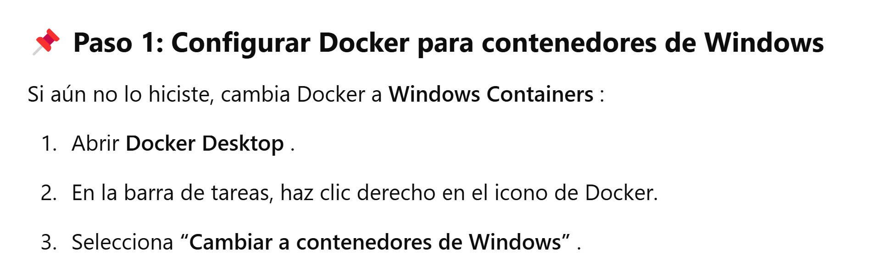
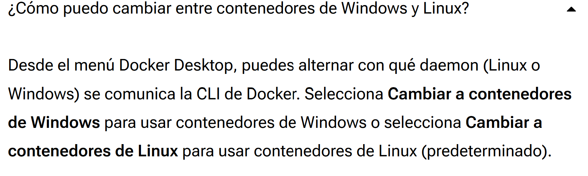

# Crear un servidor en docker para IIS
Para crear un servidor en docker al parecer es necesario el windows con docker pero estoy teniendo errores ya que al parecer estoy con linux 

siguiendo los pasos me sale que la instalacion es por que mi docker esta configurado con lo de linux y no con windows.

Por ejemplo me sale aqui que tengo que cambiar los comando de linux a windows.
tambien de igual forma busque en la pagina oficial de docker y me sale esto.

cosa que a mi no me sale entonces otra opcion que estaba viendo seria reinstalar docker y activar una configuracion que no lo hice cuando lo instale. 
